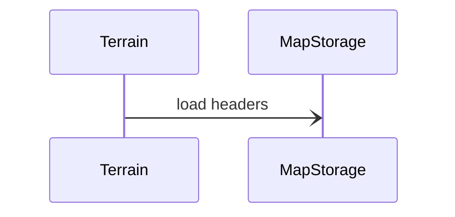
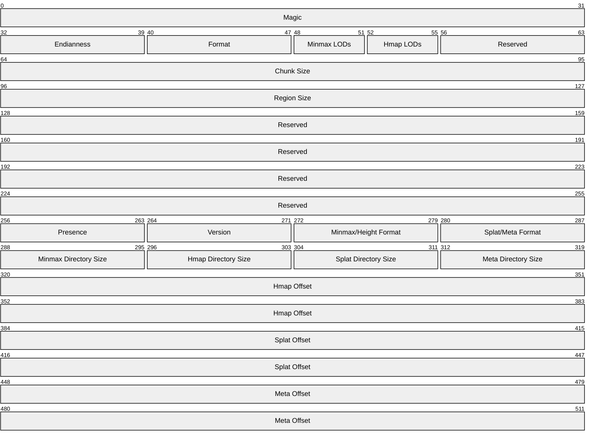

# Introduction

This is an introduction.

```mermaid
sequenceDiagram
Terrain-)MapStorage: load headers
```

```mermaid
packet
0-31: "Magic"
+8: "Endianness"
+8: "Format"
+4: "Minmax LODs"
+4: "Hmap LODs"
+8: "Reserved"
+32: "Chunk Size"
+32: "Region Size"
+64: "Reserved"
+64: "Reserved"
+8: "Presence"
+8: "Version"
+8: "Minmax/Height Format"
+8: "Splat/Meta Format"
+8: "Minmax Directory Size"
+8: "Hmap Directory Size"
+8: "Splat Directory Size"
+8: "Meta Directory Size"
+64: "Hmap Offset"
+64: "Splat Offset"
+64: "Meta Offset"
```
